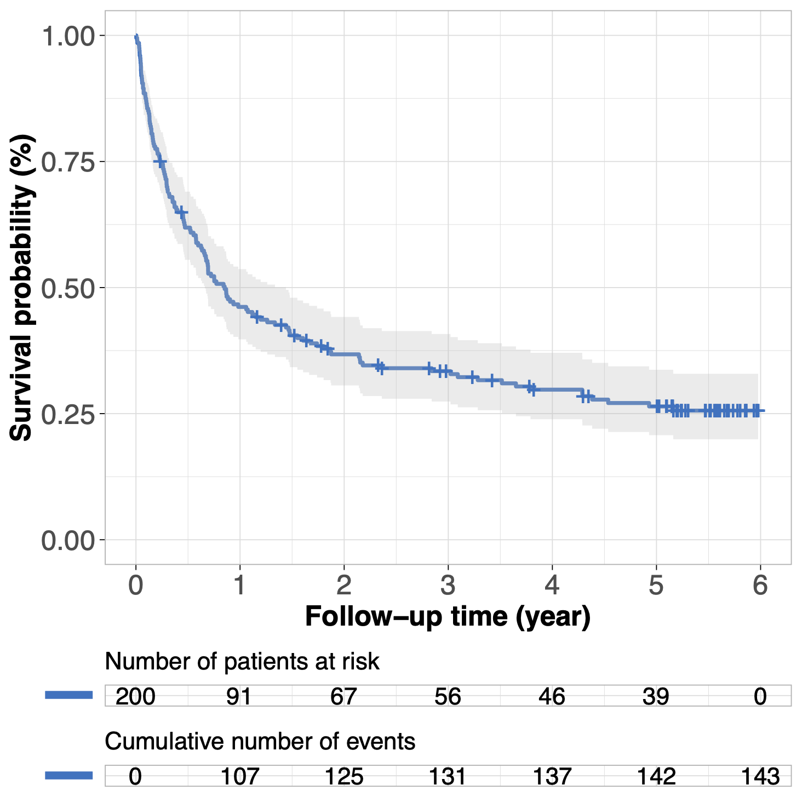
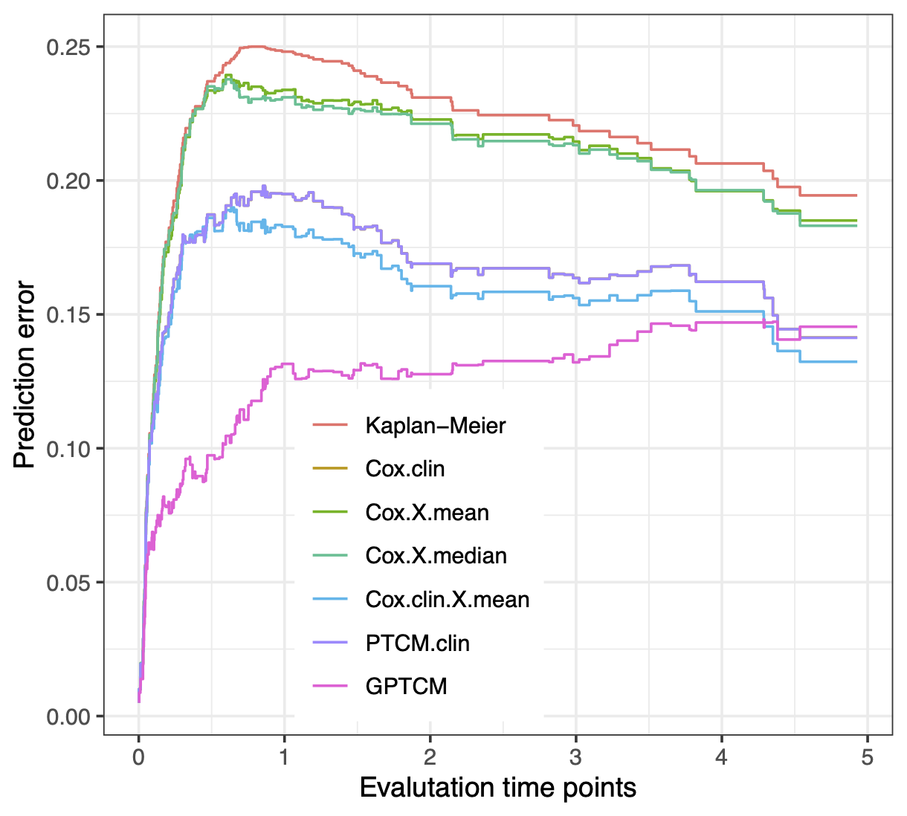
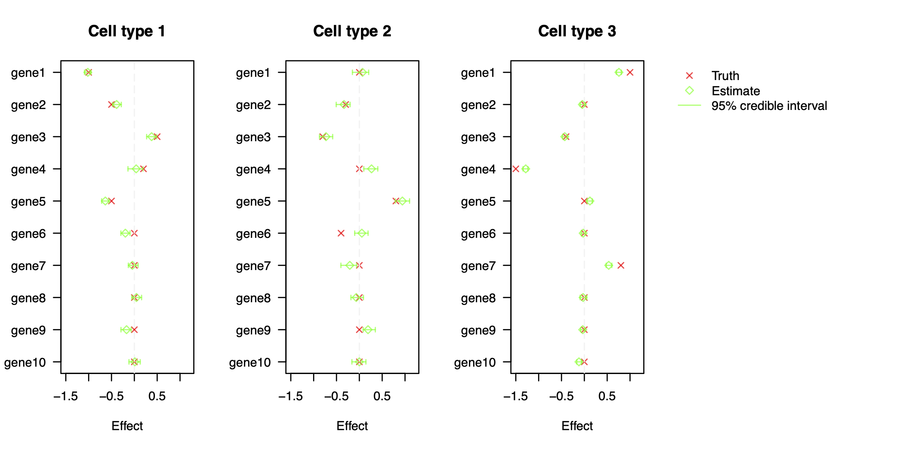

# GPTCM
<!-- 
[](https://cran.r-project.org/package=GPTCM)
[](https://ocbe-uio.r-universe.dev/GPTCM)
[](https://www.gnu.org/licenses/gpl-3.0)
[](https://doi.org/10.32614/CRAN.package.GPTCM)
[](https://github.com/zhizuio/GPTCM/actions)
-->


This is an R package **GPTCM** implementing Bayesian hierarchical modeling for a generalized promotion time cure model (GPTCM) ([Zhao \& Kızılaslan, 2024](https://doi.org/10.48550/arXiv.2408.17188)) for the identification of cell-type-specific tumor driver genes and survival prognosis. 

## Installation

Install the latest development version from [GitHub](https://github.com/zhizuio/GPTCM):

```r
#install.packages("remotes")
remotes::install_github("zhizuio/GPTCM")
```

## Simulation study

We provide insights about the parameter estimation of the proposed GPTCM by using Monte Carlo simulations. 
We consider sample sizes of $n=200$. 
Each sample/patient has two clinical covariates (i.e. one row of the clinical data matrix $\mathbf X_0\in \mathbb R^{n\times 2}$), and has cells belonging to $L=3$ tumor cell subtypes with each subtype consisting of $10$ cell-type-specific covariates (i.e. one row of data matrix $\mathbf X_l\in \mathbb R^{n\times 10}$, $l\in \{1,...,L\}$). 
Each sample also has tumor cell subtype proportions data (i.e. one row of the proportions data matrix $\mathbf p\in [0,1]^{n\times 10}$) 
generated by $10$ cell-type-specific covariates based on the Dirichlet regression model. 
Every covariate is generated independently from the standard normal distribution except the first clinical variable generated from the Bernoulli distribution. 
The tumor cell subtype proportions of each sample is generated independent from the Dirichlet distribution. 

The survival times are generated based on the population survival function using rate parameter $\theta=\exp(\xi_0+\mathbf X_0\boldsymbol\xi)$, 
and using the Weibull distributed survival functions with 
mean parameters $\log \boldsymbol\mu_{l}=\mathbf X_{l} \boldsymbol \beta_l$, $l\in \{1,...,L\}$. 
Censoring is generated through an exponential distribution with censoring rate $28.5\%$. 
The Kaplan–Meier survival curve is as follows.

```{r}
rm(list=ls())

# simulate data
set.seed(123)
n <- 200 # subjects
p <- 10 # variable selection predictors
L <- 3 # cell types
library(GPTCM)
set.seed(123)
dat <- simData(n, p, L)

# KM curve
library(survival)
library(survminer)
fit.km <- survival::survfit(Surv(time, event) ~ 1, data = dat$survObj)
ggsurv <- survminer::ggsurvplot(fit.km,
                                conf.int = TRUE, 
                                xlab = "Follow-up time (year)",
                                ylab = "Survival probability (%)",
                                legend = "none",
                                risk.table = TRUE,
                                cumevents = TRUE,
                                palette = "jco",
                                risk.table.title = "Number of patients at risk",
                                tables.height = 0.1,
                                tables.theme = theme_cleantable(), 
                                tables.y.text = FALSE, 
                                ggtheme = theme_light() 
)
ggsurv$plot <- ggsurv$plot + 
  theme(axis.text=element_text(size=15), 
        axis.title=element_text(size=15,face="bold"))
ggsurv
```



After running our proposed GPTCM, we compare its the survival prediction performance with other approaches (i.e. Kaplan-Meier method without covariates, classic Cox model with two clinical covariates, Cox model with cell-type proportions data as covariates, Cox model with both clinical and cell-type proportion covariates, Cox model with clinical and aggregated (mean) cell-type-specific covariates, Cox model with clinical and aggregated (median) cell-type-specific covariates, mixture cure model with clinical and aggregated (mean) cell-type-specific covariates, mixture cure model with clinical and aggregated (median) cell-type-specific covariates). 
The follow figure shows the prediction performance of time-dependent Brier scores. 
It is clear that our GPTCM has much better survival prognosis than other approaches. 

```{r}
## run Bayesian GPTCM
set.seed(123)
fit <- GPTCM(dat)

# draw time-dependent Brier scores
plotBrier(dat, datMCMC = fit, 
          time.star = 5, 
          xlab = "Evalutation time points",
          ylab = "Prediction error")
```



The following figure shows the well estimated cell-type-specific effects associated with cell-type-specific progression. 

```{r}
plotCoeff(dat, datMCMC = fit, 
          estimator = "beta",
          label.y = paste0("gene", 1:p),
          legend.labs = c("Truth", "Estimate", "95% credible interval"))
```



## References

Chen, M.-H., Ibrahim, J. G., and Sinha, D. (1999). A new Bayesian model for survival data with
a surviving fraction. Journal of the American Statistical Association, 94(447):909--919.

Yakovlev, A. (1996). Threshold models of tumor recurrence. Mathematical and Computer Modelling,
23(6):153--164.

Zhao Z, Kızılaslan F. (2024). A note on promotion time cure models with a new biological consideration. arXiv,
DOI https://doi.org/10.48550/arXiv.2408.17188.
